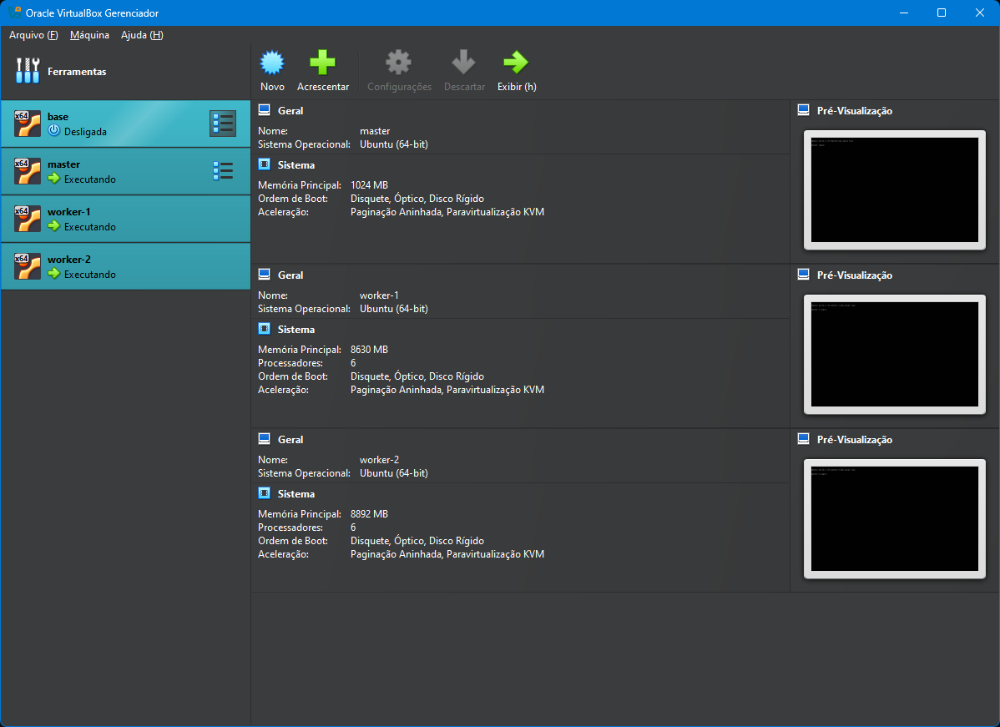
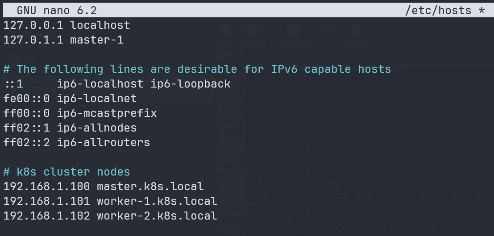
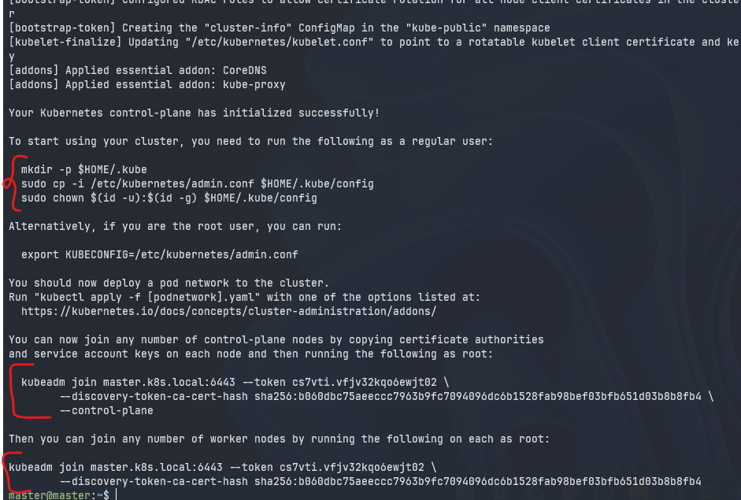
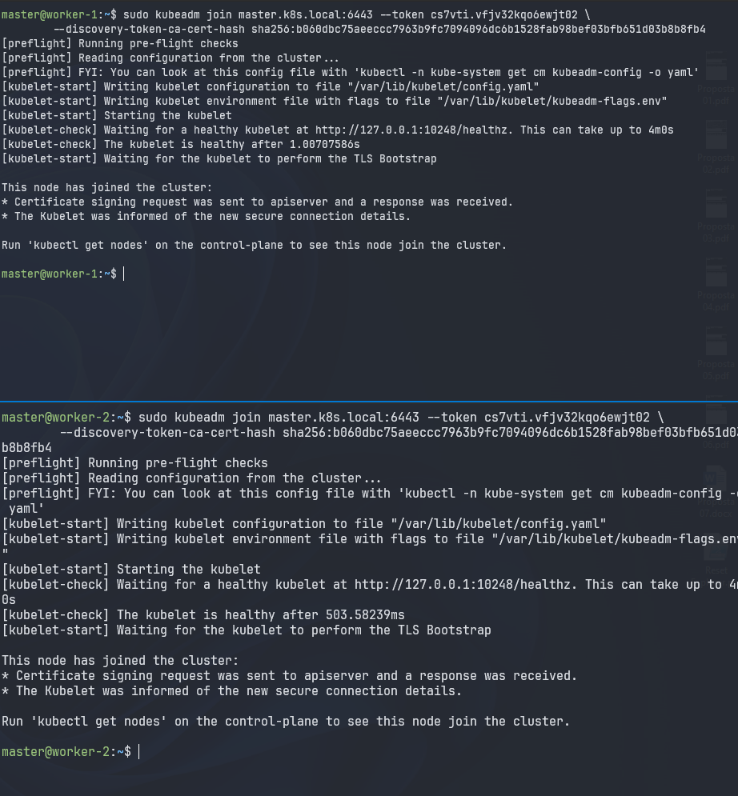
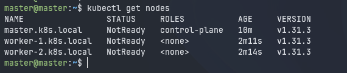
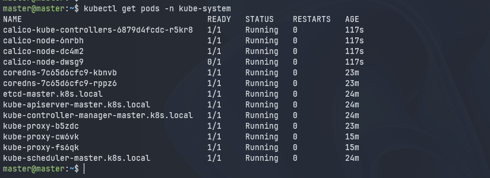
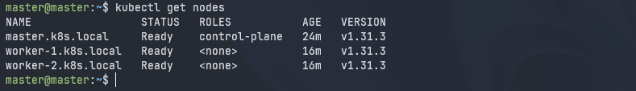
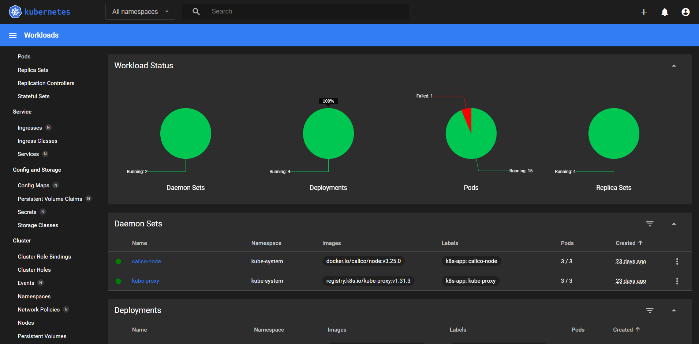
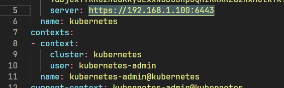

# Cluster Kubernetes

> _Este repositório contém uma documentação detalhada com instruções e comandos para configurar, gerenciar e operar um cluster Kubernetes em um ambiente de desenvolvimento local. Inclui desde a configuração básica das VMs e rede até a implantação de aplicações em Kubernetes, integração com ferramentas como Terraform, e acesso ao Kubernetes Dashboard._

Abaixo está uma visão geral do conteúdo abordado:

<div align="center">
  
</div>

<div align="center">
  
</div>


## 📄 Visão Geral

- Configuração de um cluster Kubernetes em máquinas virtuais (VirtualBox).
- Passos para configurar IP estático e hostname das VMs.
- Instalação e configuração de ferramentas essenciais como Docker, Calico e Kubernetes.
- Criação de deploys e serviços para gerenciar aplicações distribuídas no cluster.
- Configuração do Kubernetes Dashboard para monitoramento e gestão.
- Utilização de Terraform para gerenciar recursos no cluster.

## 🖥️ Infraestrutura

> O cluster é composto por três máquinas virtuais rodando Ubuntu Server 24.10, cada uma configurada com 2GB de memória e 2 vCPUs:

- **master.k8s.local** - 192.168.1.100
- **worker-1.k8s.local** - 192.168.1.101
- **worker-2.k8s.local** - 192.168.1.102


## 🚀 Recursos Incluídos

1. **Configuração Inicial**:
   - Atualização de pacotes, instalação de ferramentas e configuração de IP estático.
   - Desativação de memória swap e habilitação de encaminhamento de pacotes IPv4.

2. **Instalação de Software**:
   - Docker e Containerd.
   - Kubernetes (`kubelet`, `kubeadm`, `kubectl`).

3. **Gerenciamento do Cluster**:
   - Inicialização do cluster com `kubeadm`.
   - Instalação de Calico como rede de pods.
   - Implantação de aplicações usando Deployments, DaemonSets e Services.

4. **Acesso e Monitoramento**:
   - Configuração do Kubernetes Dashboard com autenticação baseada em token.
   - Acesso ao cluster a partir de uma máquina local utilizando `kubeconfig`.

5. **Automatização com Terraform**:
   - Criação e gerenciamento de recursos Kubernetes via Terraform.

## 🔗 Links Úteis

- [Playlist: Kubernetes Cluster no YouTube](https://www.youtube.com/watch?v=iwlNCePWiw4&list=PLHMWRJcYzpI436YPGOf33qOf4p6q8I7pD)

---

> [!WARNING]
> O IP do master.k8s.local deve ser configurado no arquivo de configuração do Netplan para 192.168.1.xxx/24.

---

## apt update & upgrade & tools

```bash
sudo apt update
sudo apt upgrade -y
sudo apt install nano inetutils-ping net-tools curl gnupg2 software-properties-common apt-transport-https ca-certificates -y
```

---

## Passos para Configurar o IP Estático:

> Edite o arquivo de configuração do Netplan

```bash
ls /etc/netplan/
```

> Normalmente, haverá um arquivo com extensão .yaml, como 01-netcfg.yaml. Abra este arquivo para edição (substitua o nome do arquivo pelo nome listado no seu sistema):

> Modifique o conteúdo do arquivo para configurar o endereço IP estático. Exemplo de configuração para 192.168.1.xxx/24:

> Após salvar as alterações no arquivo YAML, aplique as novas configurações de rede com:

```bash
sudo netplan apply
```

> Confirme se configurou corretamente:

```bash
ip addr show
ping 8.8.8.8
```

---

## Hostnames

> Configurando os Hostnames de cada VM

```bash
sudo hostnamectl set-hostname master.k8s.local # master
sudo hostnamectl set-hostname worker-1.k8s.local # worker-1
sudo hostnamectl set-hostname worker-2.k8s.local # worker-2
```

> Editando o arquivo `/etc/hosts`

```bash
sudo nano /etc/hosts
```

> Adicionando as linhas:

```bash
# k8s cluster nodes
192.168.1.100 master.k8s.local
192.168.1.101 worker-1.k8s.local
192.168.1.102 worker-2.k8s.local
```



> Reinicializando o sistema

```bash
sudo reboot
```

> Verificando os Hostnames

```bash
hostnamectl
```

---

## Desativar a memória swap

```bash
sudo swapoff -a
sudo sed -i '/\/swap.img/s/^/#/' /etc/fstab
```

> Após executar, você pode verificar se a alteração foi aplicada corretamente com:

```bash
cat /etc/fstab
```

---

## Configurar o encaminhamento de pacotes no IPv4

```bash
sudo modprobe overlay
sudo modprobe br_netfilter
sudo tee /etc/sysctl.d/kubernetes.conf<<EOF
net.bridge.bridge-nf-call-ip6tables = 1
net.bridge.bridge-nf-call-iptables = 1
net.ipv4.ip_forward = 1
EOF

sudo sysctl --system
```

---

## Instalar o Docker

```bash
sudo curl -fsSL https://download.docker.com/linux/ubuntu/gpg | sudo gpg --dearmour -o /etc/apt/trusted.gpg.d/docker.gpg
sudo add-apt-repository "deb [arch=amd64] https://download.docker.com/linux/ubuntu $(lsb_release -cs) stable"
sudo apt update
sudo apt install -y containerd.io
```

```bash
containerd config default | sudo tee /etc/containerd/config.toml >/dev/null 2>&1
sudo sed -i 's/SystemdCgroup \= false/SystemdCgroup \= true/g' /etc/containerd/config.toml
sudo systemctl restart containerd
sudo systemctl enable containerd
```

---

## Instalaçao do kubernetes

```bash
curl -fsSL https://pkgs.k8s.io/core:/stable:/v1.31/deb/Release.key | sudo gpg --dearmor -o /etc/apt/keyrings/kubernetes-apt-keyring.gpg
echo 'deb [signed-by=/etc/apt/keyrings/kubernetes-apt-keyring.gpg] https://pkgs.k8s.io/core:/stable:/v1.31/deb/ /' | sudo tee /etc/apt/sources.list.d/kubernetes.list

sudo apt-get update
sudo apt-get install -y kubelet kubeadm kubectl
sudo apt-mark hold kubelet kubeadm kubectl
```

---

> [!WARNING]
> Os camandos abaixo devem ser executados no `master.k8s.local`

## Inicializa o cluster

```bash
sudo kubeadm init \
  --apiserver-advertise-address=192.168.1.100 \
  --pod-network-cidr=192.168.0.0/16
```

> Esse pode demorar um pouco. Ele retornará os passou seguintes.

> [!WARNING]
> A seguir, apenas um exemplo do que os comandos retornaram nas minhas maquina `master.k8s.local`



> Rode os comando solicitados no `master.k8s.local`

```bash
mkdir -p $HOME/.kube
sudo cp -i /etc/kubernetes/admin.conf $HOME/.kube/config
sudo chown $(id -u):$(id -g) $HOME/.kube/config
```

> Copie os comandos retornados e execute ele no worker-1.k8s.local e no worker-2.k8s.local

```bash
sudo kubeadm join master.k8s.local:6443 --token cs7vti.**************** \
        --discovery-token-ca-cert-hash sha256:*****************************
```



> Rodando os comando a seguir na maquina `master.k8s.local` já da para ver se o cluster foi iniciado corretamente.

```bash
kubectl cluster-info
kubectl get nodes
```



## Instale o Calico Pod Network para na maquina `master.k8s.local`

```bash
kubectl apply -f https://docs.projectcalico.org/manifests/calico.yaml
```

> Verificaremos se o calico foi implantado com sucesso, verificando os pods no namespacekube-system

```bash
kubectl get pods -n kube-system
```



> Se o status for Em execução, significa que a implantação foi bem-sucedida. Agora, se você verificar o status dos nós, o status será Pronto.

```bash
kubectl get nodes
```



---

## Deploy com Replicação

Aqui está um exemplo prático para rodar um container em cada máquina (nó) do cluster Kubernetes. Vamos criar uma aplicação simples com NGINX, onde cada nó executará um pod.

---

### **1. Configuração Inicial: Deploy com Replicação**

Criaremos um Deployment com 3 réplicas, onde cada réplica será atribuída automaticamente a um nó do cluster.

```yaml
# arquivo: nginx-deployment.yaml
apiVersion: apps/v1
kind: Deployment
metadata:
  name: nginx-deployment
  labels:
    app: nginx
spec:
  replicas: 3
  selector:
    matchLabels:
      app: nginx
  template:
    metadata:
      labels:
        app: nginx
    spec:
      containers:
      - name: nginx
        image: nginx:latest
        ports:
        - containerPort: 80
```

**Comando para aplicar:**

```bash
kubectl apply -f nginx-deployment.yaml
```

**Verifique se os pods foram criados:**

```bash
kubectl get pods -o wide
```

Isso mostrará a localização dos pods nos nós (`NODE`), algo assim:

```
NAME                                READY   STATUS    RESTARTS   AGE   NODE
nginx-deployment-5d9b85749f-abcde   1/1     Running   0          10s   worker-1.k8s.local
nginx-deployment-5d9b85749f-xyz01   1/1     Running   0          10s   worker-2.k8s.local
nginx-deployment-5d9b85749f-qwert   1/1     Running   0          10s   master.k8s.local
```

---

### **2. Garantindo 1 Pod por Máquina: DaemonSet**

Se quiser garantir que sempre haverá um pod em cada nó (independentemente de quantos nós existirem), você pode usar um DaemonSet.

```yaml
# arquivo: nginx-daemonset.yaml
apiVersion: apps/v1
kind: DaemonSet
metadata:
  name: nginx-daemonset
  labels:
    app: nginx
spec:
  selector:
    matchLabels:
      app: nginx
  template:
    metadata:
      labels:
        app: nginx
    spec:
      containers:
      - name: nginx
        image: nginx:latest
        ports:
        - containerPort: 80
```

**Comando para aplicar:**

```bash
kubectl apply -f nginx-daemonset.yaml
```

**Verifique os pods criados:**

```bash
kubectl get pods -o wide
```

Você verá que há exatamente um pod rodando em cada nó, algo assim:

```
NAME                          READY   STATUS    RESTARTS   AGE   NODE
nginx-daemonset-abc12         1/1     Running   0          10s   master.k8s.local
nginx-daemonset-xyz34         1/1     Running   0          10s   worker-1.k8s.local
nginx-daemonset-qwert56       1/1     Running   0          10s   worker-2.k8s.local
```

---

### **3. Expondo a Aplicação (Opcional)**

Para acessar os pods em uma aplicação distribuída, use um `Service` que balanceia o tráfego entre os pods.

```yaml
# arquivo: nginx-service.yaml
apiVersion: v1
kind: Service
metadata:
  name: nginx-service
spec:
  selector:
    app: nginx
  ports:
  - protocol: TCP
    port: 80
    targetPort: 80
  type: NodePort
```

**Comando para aplicar:**

```bash
kubectl apply -f nginx-service.yaml
```

**Obtenha o NodePort e acesse a aplicação:**

```bash
kubectl get svc nginx-service
```

Você verá algo como:

```
NAME            TYPE        CLUSTER-IP       EXTERNAL-IP   PORT(S)        AGE
nginx-service   NodePort    10.96.183.239    <none>        80:32000/TCP   10s
```

Agora você pode acessar a aplicação em qualquer nó, utilizando o IP do nó e a porta `32000`. Por exemplo:

```
http://192.168.1.100:32000  # Acessando o master
http://192.168.1.101:32000  # Acessando o worker-1
http://192.168.1.102:32000  # Acessando o worker-2
```

---

Aqui está uma versão passo a passo para configurar o acesso ao **Kubernetes Dashboard** e gerar o token manualmente, garantindo que tudo seja configurado corretamente.

---

### **Passo 1: Implantar o Kubernetes Dashboard**

Aplique o manifesto oficial do Kubernetes Dashboard:

```bash
kubectl apply -f https://raw.githubusercontent.com/kubernetes/dashboard/v2.7.0/aio/deploy/recommended.yaml
```

Este comando cria o Dashboard no namespace `kubernetes-dashboard`. Para verificar:

```bash
kubectl get pods -n kubernetes-dashboard
```

---

## **Kubernetes Dashboard**

### **Passo 2: Expor o Dashboard**

Edite o serviço do Dashboard para torná-lo acessível externamente usando um `NodePort`:

```bash
kubectl -n kubernetes-dashboard edit service kubernetes-dashboard
```

Altere o tipo de serviço de `ClusterIP` para `NodePort`:

```yaml
spec:
  type: NodePort
```

Salve e saia do editor. Em seguida, descubra a porta externa:

```bash
kubectl -n kubernetes-dashboard get svc kubernetes-dashboard
```

Você verá algo como:

```
NAME                   TYPE       CLUSTER-IP      EXTERNAL-IP   PORT(S)         AGE
kubernetes-dashboard   NodePort   10.96.183.239   <none>        443:32000/TCP   2m
```

Agora você pode acessar o Dashboard na porta mostrada com o comando anterior(`https://<IP_DO_NÓ>:32000`).



---

### **Passo 3: Criar o Usuário Admin**

Crie um arquivo YAML chamado `dashboard-admin.yaml` com o conteúdo abaixo para criar um usuário `admin-user` e vinculá-lo ao `ClusterRoleBinding` com permissões de administrador:

```yaml
apiVersion: v1
kind: ServiceAccount
metadata:
  name: admin-user
  namespace: kubernetes-dashboard
---
apiVersion: rbac.authorization.k8s.io/v1
kind: ClusterRoleBinding
metadata:
  name: admin-user-binding
roleRef:
  apiGroup: rbac.authorization.k8s.io
  kind: ClusterRole
  name: cluster-admin
subjects:
- kind: ServiceAccount
  name: admin-user
  namespace: kubernetes-dashboard
```

Aplique o arquivo:

```bash
kubectl apply -f dashboard-admin.yaml
```

---

### **Passo 4: Gerar o Token Manualmente**

Com o usuário criado, gere um token para autenticação:

```bash
kubectl -n kubernetes-dashboard create token admin-user
```

O comando retorna o token diretamente:

```
eyJhbGciOiJSUzI1NiIsImtpZCI6...
```

Copie o token para usar na interface do Kubernetes Dashboard.

---

### **Passo 5: Fazer Login no Dashboard**

1. Abra o navegador e acesse o Dashboard:

   ```
   https://<IP_DO_NÓ>:<PORTA_NODEPORT>
   ```

   Exemplo:

   ```
   https://192.168.1.100:32000
   ```
2. No painel de login, selecione **Token**.
3. Cole o token gerado no campo e clique em "Login".

---

### **Passo 6: (Opcional) Verificar os Recursos**

Depois de fazer login, você pode verificar o status dos nós, pods, serviços e outros recursos no Dashboard.

---

### **Nota Adicional**

Se preferir restringir o acesso ou usar certificados para o Dashboard, você pode configurar o serviço como `LoadBalancer` e usar um balanceador de carga externo ou gerenciar o tráfego com um ingress.

---

## **Acessando o Cluster Kubernetes**

Para acessar o cluster Kubernetes a partir da sua máquina local (laptop), você precisa configurar o arquivo `kubeconfig` da sua máquina para apontar para o cluster. Aqui está o passo a passo detalhado:

---

# **Configuração do Kubeconfig**

### **Passo 1: Copiar o Arquivo Kubeconfig do Master**

No nó master do Kubernetes, o arquivo de configuração está localizado em `/etc/kubernetes/admin.conf`. Este arquivo é necessário para autenticar e se conectar ao cluster.

1. No nó master, copie o arquivo `admin.conf` para um local temporário (ou diretamente para sua máquina local):

```bash
sudo cat /etc/kubernetes/admin.conf
```

2. Copie o conteúdo exibido e salve-o no seu laptop como `~/.kube/config`. Certifique-se de criar o diretório `~/.kube` caso ele não exista:

```bash
mkdir -p ~/.kube
nano ~/.kube/config
```

3. Cole o conteúdo do arquivo `admin.conf` na janela do editor e salve.

---

### **Passo 2: Tornar o Arquivo Kubeconfig Acessível**

Altere as permissões do arquivo no laptop para garantir que o Kubernetes CLI (kubectl) possa usá-lo:

```bash
chmod 600 ~/.kube/config
```

> [!WARNING]
> Pode ser que seja alterar o IP da máquina master no arquivo para possibilidade de acesso remoto.



---

### **Passo 3: Verificar Conectividade com o Cluster**

Certifique-se de que sua máquina local consegue acessar os nós do cluster Kubernetes. Isso pode exigir configuração de rede ou VPN dependendo do ambiente.

1. Teste o acesso aos nós do cluster:

   ```bash
   ping 192.168.1.100
   ping 192.168.1.101
   ping 192.168.1.102
   ```
2. Confirme o acesso ao cluster com `kubectl`:

   ```bash
   kubectl get nodes
   ```

   Se o cluster estiver configurado corretamente, você verá os nós listados.

---

### **Passo 4: Configurar o Acesso Remoto**

Se você não consegue acessar os IPs diretamente, você pode configurar um túnel SSH ou expor o servidor API do Kubernetes para acesso externo.

#### **Opção 1: Túnel SSH**

Estabeleça um túnel SSH para o nó master:

```bash
ssh -L 6443:127.0.0.1:6443 user@192.168.1.100
```

Depois, edite o arquivo `~/.kube/config` no laptop para alterar o `server` do cluster para `127.0.0.1:6443`:

```yaml
clusters:
- cluster:
    server: https://127.0.0.1:6443
```

#### **Opção 2: Expor a API Kubernetes para o IP Público**

Edite o arquivo `/etc/kubernetes/manifests/kube-apiserver.yaml` no nó master para permitir o acesso da sua máquina local.

1. Abra o arquivo:

   ```bash
   sudo nano /etc/kubernetes/manifests/kube-apiserver.yaml
   ```
2. Adicione o seguinte parâmetro sob `command`:

   ```yaml
   - --bind-address=0.0.0.0
   ```
3. Reinicie o nó master ou o processo do Kubernetes API Server:

   ```bash
   sudo systemctl restart kubelet
   ```
4. Use o IP do nó master no campo `server` no arquivo kubeconfig no laptop:

   ```yaml
   clusters:
   - cluster:
       server: https://192.168.1.100:6443
   ```

---

### **Passo 5: Configurar Certificados para Segurança**

Se você estiver acessando o cluster fora da rede local, considere configurar certificados e firewall para proteger o acesso.

- Gere um certificado para o servidor API do Kubernetes.
- Restrinja o acesso por IP ao nó master usando `iptables` ou configurações do firewall.

---

# Terraform

Gerenciar o cluster Kubernetes com **Terraform** é uma ótima maneira de automatizar e padronizar as operações. O Terraform pode ser usado para interagir com o cluster e provisionar recursos como Namespaces, Deployments, Services, ConfigMaps, entre outros. Aqui está como você pode começar:

---

### **Passo 1: Instalar o Provider do Kubernetes**

Certifique-se de ter o Terraform instalado e adicione o provider do Kubernetes ao seu arquivo `main.tf`. O provider do Kubernetes permite que você gerencie recursos do cluster diretamente.

```hcl
terraform {
  required_providers {
    kubernetes = {
      source  = "hashicorp/kubernetes"
      version = "~> 2.21"
    }
  }
}

provider "kubernetes" {
  config_path    = "~/.kube/config" # Caminho para o arquivo kubeconfig
  config_context = "kubernetes-admin@kubernetes" # Contexto do cluster
}
```

- **`config_path`:** Especifica o caminho para o kubeconfig. Normalmente, está localizado em `~/.kube/config`.
- **`config_context`:** Define o contexto para o cluster. Substitua pelo contexto correto, caso você tenha vários clusters configurados.

---

### **Passo 2: Criar Recursos no Kubernetes**

Depois de configurar o provider, você pode criar recursos Kubernetes como Namespaces, Pods, Deployments, Services, etc.

#### Exemplo: Criar um Namespace

```hcl
resource "kubernetes_namespace" "example" {
  metadata {
    name = "example-namespace"
  }
}
```

#### Exemplo: Criar um Deployment

```hcl
resource "kubernetes_deployment" "nginx" {
  metadata {
    name      = "nginx-deployment"
    namespace = kubernetes_namespace.example.metadata[0].name
    labels = {
      app = "nginx"
    }
  }

  spec {
    replicas = 2

    selector {
      match_labels = {
        app = "nginx"
      }
    }

    template {
      metadata {
        labels = {
          app = "nginx"
        }
      }

      spec {
        container {
          name  = "nginx"
          image = "nginx:latest"

          port {
            container_port = 80
          }
        }
      }
    }
  }
}
```

#### Exemplo: Criar um Service

```hcl
resource "kubernetes_service" "nginx" {
  metadata {
    name      = "nginx-service"
    namespace = kubernetes_namespace.example.metadata[0].name
  }

  spec {
    selector = {
      app = "nginx"
    }

    port {
      port        = 80
      target_port = 80
    }

    type = "NodePort"
  }
}
```

---

### **Passo 3: Aplicar o Terraform**

Execute os comandos abaixo para aplicar a configuração no cluster Kubernetes:

1. **Inicializar o Terraform:**

   ```bash
   terraform init
   ```
2. **Planejar as mudanças:**

   ```bash
   terraform plan
   ```
3. **Aplicar as mudanças:**

   ```bash
   terraform apply
   ```

---

### **Passo 4: Validar os Recursos no Cluster**

Depois que o Terraform aplicar as configurações, você pode validar os recursos no cluster Kubernetes:

```bash
kubectl get all -n example-namespace
```

---

### **Passo 5: Gerenciar Alterações**

O Terraform permite que você gerencie alterações no cluster declarativamente. Sempre que você modificar os arquivos `.tf`, o Terraform calculará a diferença e aplicará as alterações necessárias.

---

### **Passo 6: Organizar os Arquivos Terraform**

Para um projeto maior, você pode organizar seus arquivos Terraform em módulos ou diretórios para facilitar a manutenção:

- `main.tf`: Contém a configuração principal.
- `variables.tf`: Define as variáveis reutilizáveis.
- `outputs.tf`: Define as saídas para exibição.
- `modules/`: Contém módulos separados para diferentes componentes, como `namespace`, `deployment`, etc.

---

### **Passo 7: Adicionar Integrações (Opcional)**

- **Provisionamento de Infraestrutura:** Use Terraform para provisionar os nós do cluster em provedores como DigitalOcean, AWS ou Google Cloud.
- **Integração com CI/CD:** Configure pipelines para aplicar configurações Terraform automaticamente.
- **Configuração de Secrets:** Combine o Terraform com o HashiCorp Vault ou outras ferramentas de gerenciamento de secrets.

---

## Rodar PODS na Máquina Master?

> Por padrão, no Kubernetes, o nó **master** (também chamado de **control-plane**) não é usado para agendar e executar pods de workloads (trabalhos) de usuários. Isso ocorre devido a um rótulo (`taint`) especial que o Kubernetes aplica ao nó master durante a inicialização do cluster. O objetivo dessa configuração padrão é separar as funções do plano de controle e as workloads para garantir:

1. **Estabilidade do Cluster:**

   - O master hospeda componentes críticos do Kubernetes, como o API Server, Scheduler, e Controller Manager. Manter esses componentes separados de workloads reduz a chance de interferência ou sobrecarga que poderia afetar o gerenciamento do cluster.
2. **Segurança:**

   - O nó master geralmente tem acesso privilegiado e é um ponto central no cluster. Separá-lo dos workloads limita o escopo de possíveis falhas de segurança.
3. **Alta Disponibilidade:**

   - Em um cluster de produção com múltiplos masters, o uso exclusivo dos masters para o plano de controle ajuda a manter o cluster operacional mesmo que alguns nós de trabalho (workers) falhem.

---

### **Como Isso Funciona?**

O Kubernetes usa um mecanismo chamado **taints** para evitar que o nó master seja usado para workloads.

Se você executar o comando abaixo, verá os taints aplicados ao nó master:

```bash
kubectl describe node master.k8s.local
```

Na saída, você verá algo como:

```
Taints:
  node-role.kubernetes.io/control-plane:NoSchedule
```

Esse `taint` impede que pods comuns sejam agendados no nó master. O `NoSchedule` significa que os pods só serão agendados no nó se tiverem a tolerância explícita para este taint.

---

### **Como Permitir que o Master Execute Pods?**

Se você deseja usar o nó master para executar pods de workloads, você pode remover o taint aplicado ao nó master. Aqui está como fazer isso:

#### Passo 1: Remover o Taint no Nó Master

Execute o comando abaixo para remover o taint:

```bash
kubectl taint nodes master.k8s.local node-role.kubernetes.io/control-plane:NoSchedule-
```

**Explicação do comando:**

- O `-` no final remove o taint.
- Substitua `master.k8s.local` pelo nome exato do nó master no seu cluster.

#### Passo 2: Verificar se o Taint foi Removido

Depois de remover o taint, verifique novamente a configuração do nó:

```bash
kubectl describe node master.k8s.local
```

Na seção `Taints`, você não verá mais o `NoSchedule`.

#### Passo 3: Testar o Agendamento de Pods no Master

Agora, se você criar pods ou deployments sem especificar nós específicos, o agendador do Kubernetes poderá escolher o master para executar os pods.

Exemplo:

```bash
kubectl run test-pod --image=nginx --restart=Never
kubectl get pods -o wide
```

Você verá que o pod pode ser agendado no nó master.

---

### **Considerações Importantes**

1. **Desempenho e Estabilidade:**

   - Usar o nó master para workloads pode afetar o desempenho do cluster se os recursos forem limitados, especialmente se houver muitas workloads competindo com os componentes do plano de controle.
2. **Clusters de Produção:**

   - Em ambientes de produção, recomenda-se manter o master dedicado ao controle do cluster. Para pequenos clusters de desenvolvimento ou teste, usar o master para workloads pode ser aceitável.
3. **Escalabilidade:**

   - Se o master for usado para workloads em clusters maiores, é importante monitorar os recursos (CPU, memória, etc.) do nó master para evitar sobrecarga.

---

## **Reverter a Configuração para Impedir que o Master Execute Pods**

Para reverter a configuração e impedir que o nó master do Kubernetes agende pods de workloads novamente, você pode adicionar de volta o **taint** ao nó master. Aqui está como fazer isso:

---

### **Passo 1: Adicionar o Taint ao Nó Master**

Execute o comando abaixo para aplicar novamente o taint padrão ao nó master:

```bash
kubectl taint nodes master.k8s.local node-role.kubernetes.io/control-plane:NoSchedule
```

**Explicação do comando:**

- **`node-role.kubernetes.io/control-plane`:** É a chave do taint aplicada ao nó master.
- **`NoSchedule`:** Indica que o nó não pode agendar pods que não tenham a tolerância explícita para este taint.

---

### **Passo 2: Verificar se o Taint Foi Aplicado**

Depois de aplicar o taint, verifique se ele foi adicionado corretamente:

```bash
kubectl describe node master.k8s.local
```

Na saída, na seção `Taints`, você verá algo como:

```
Taints:
  node-role.kubernetes.io/control-plane:NoSchedule
```

Isso significa que o master está novamente configurado para não agendar pods de workloads.

---

### **Passo 3: Remover Pods que Já Estão Rodando no Master**

Se houver pods de workloads já rodando no nó master, você precisará removê-los ou realocá-los para os nós workers. Siga os passos abaixo:

#### Listar os Pods no Master:

```bash
kubectl get pods -o wide --all-namespaces | grep master.k8s.local
```

#### Excluir os Pods:

Se os pods forem descartáveis (por exemplo, pods de testes), você pode excluí-los com o comando:

```bash
kubectl delete pod <nome-do-pod> -n <namespace>
```

Substitua `<nome-do-pod>` e `<namespace>` pelos valores corretos.

#### Reagendar Pods Necessários:

Se os pods precisarem ser mantidos, você pode criar novos `Deployments` ou `DaemonSets` sem tolerâncias para o taint do master. Isso forçará o Kubernetes a agendá-los apenas nos nós workers.

---

### **Passo 4: Certifique-se de que o Master Está Apenas Controlando o Cluster**

Após aplicar o taint e remover os pods de workloads, o master será usado exclusivamente para gerenciar o cluster, como no estado inicial.

---

### **Restaurar Configurações Originais (Opcional)**

Se você quiser garantir que o master esteja exatamente como estava após a configuração inicial, pode verificar os arquivos do plano de controle, como `kube-apiserver.yaml`, `kube-controller-manager.yaml` e `kube-scheduler.yaml`, localizados em:

```bash
/etc/kubernetes/manifests/
```

Certifique-se de que nenhuma configuração adicional foi alterada.

---
